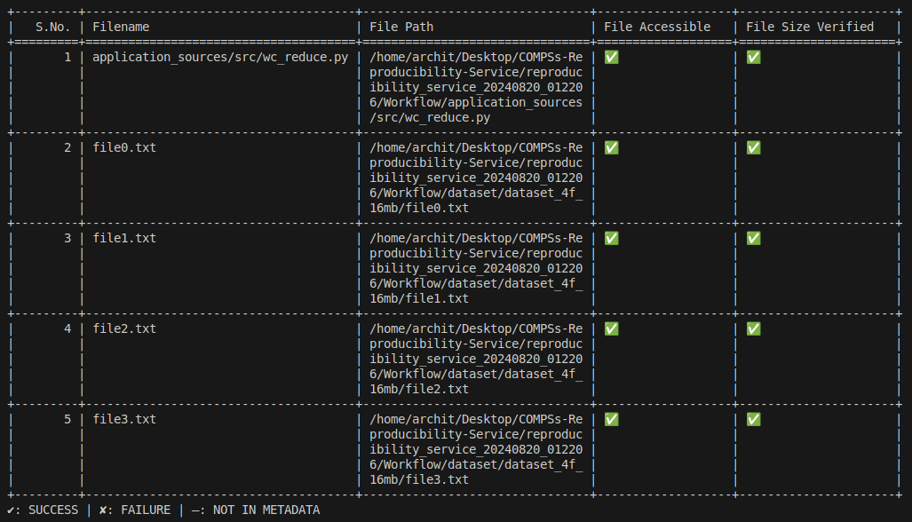

# COMPSs-Reproducibility-Service

<p align="center">
  
</p>

This is an automatic reproducibility service designed to help reproduce COMPSs workflows on your local machine or on a SLURM cluster. Below are the prerequisites and instructions for proper functioning.

## Pre-requisites

- COMPSs must be installed on your local machine, or the COMPSs module must be loaded on the cluster. For installation guidance, refer to the [COMPSs Official Installation Guide](https://compss-doc.readthedocs.io/en/stable/Sections/01_Installation.html).
- Ensure that all dependencies for the experiment you wish to reproduce are satisfied on the machine where you want to resubmit the application.

## How to Use

- Take the remote URL to the workflow (i.e. from WorkflowHub) or the path to the RO-Crate (a folder or a zip file) and pass it as the first argument to the service:
  ```bash
  python3 reproducibility_service.py <link_or_path>
- The rest of the steps are self-explanatory and occur as interactions with the program, allowing the following features:

## Features

1. **Provenance Generation**: The program prompts you for a provenance flag (`-p` flag for `runcompss`). It automatically fetches the experiment details from the metadata and only asks for the `Submitter` details.

2. **New Dataset Feature**: If you want to reproduce the same experiment with a new dataset, simply provide the path to the new dataset.
   > **Note**: The new dataset should follow the exact same directory structure as the old one for the paths to be correctly mapped.

3. **Flag Addition**: You can review the `runcompss` command line generated by the service and pass additional flags according to the needs of your new run.

4. **File Verification**: The service verifies file integrity against metadata such as file size or modification date. It generates a status table displaying the results of the verification.
<p align="center">
  
</p>

5. **Sub-directory Feature**: The service execution occurs in a separate subdirectory named `reproducibility_service_{timestamp}`, ensuring that it does not interfere with the current working directory (cwd).

6. **Results**: Any results generated by the experiment are stored in `reproducibility_service_{timestamp}/Results`. If provenance is requested, the generated RO-Crate is also stored in this directory.

7. **Logging**: Logs from the reproducibility service, such as `err.log`, `out.log`, and `rs_log`, are stored in `reproducibility_service_{timestamp}/log`.

## Known Issues (or Future Plans)

- Third party software dependencies: neither automatic detection nor loading those dependencies on a SLURM cluster are implemented. Currently, they need to be solved manually by the user.
- No support for workflows with `data_persistence = False` with all datasets as remote files.

### Experiment Requirements

1. If a folder path is provided in the `compss_submission_command_line`, the path should end with a `/`.
2. The service does not support experiments with file paths inside the source code, as these paths cannot be easily mapped.
3. The `data_persistence = False` examples are only supposed to work on the original SLURM cluster where paths related to the experiment are accessible (i.e. the new Submitter may need to request access permissions).

---

I hope you find this service helpful!
